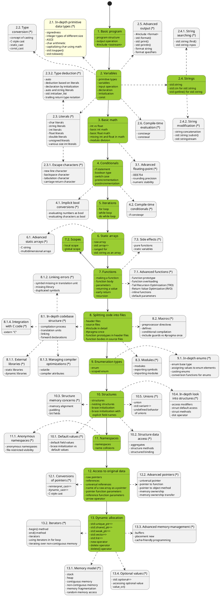

# C++ Roadmap

```plantuml
@startuml
state "1. Basic program" as Lesson_1 #YellowGreen
state "2. Variables" as Lesson_2 #YellowGreen
state "2.1. In-depth primitive\ndata types (*)" as Lesson_2_1 #LightYellow
state "2.2. Type\nconversion (*)" as Lesson_2_2
state "2.3. Literals (*)" as Lesson_2_3
state "2.3.1. Escape characters (*)" as Lesson_2_3_1
state "2.3.2. Type deduction (*)" as Lesson_2_3_2
state "2.4. Strings" as Lesson_2_4 #YellowGreen
state "2.5. Advanced\noutput (*)" as Lesson_2_5
state "2.4.1. String\nsearching (*)" as Lesson_2_4_1
state "2.4.2. String\nmodification (*)" as Lesson_2_4_2
state "3. Basic math" as Lesson_3 #YellowGreen
state "2.6. Compile-time\nevaluation (*)" as Lesson_2_6


state "3.1. Advanced\nfloating-point (*)" as Lesson_3_1
state "4. Conditionals" as Lesson_4 #YellowGreen
state "4.1. Implicit bool\nconversions (*)" as Lesson_4_1
state "5. Iterations" as Lesson_5 #YellowGreen
state "4.2. Compile-time\nconditionals (*)" as Lesson_4_2


state "7.2. Scopes" as Lesson_7_2 #YellowGreen
state "6. Static arrays" as Lesson_6 #YellowGreen
state "6.1. Advanced\nstatic arrays (*)" as Lesson_6_1

state "7. Functions" as Lesson_7 #YellowGreen
state "7.1. Advanced functions (*)" as Lesson_7_1
state "7.3. Side effects (*)" as Lesson_7_3

state "8. Splitting code into files" as Lesson_8 #YellowGreen
state "8.1. In-depth codebase\nstructure (*)" as Lesson_8_1
state "8.1.1. External\nlibraries (*)" as Lesson_8_1_1
state "8.1.2. Linking errors (*)" as Lesson_8_1_2
state "8.2. Macros (*)" as Lesson_8_2

state "10.2. Structure data\naccess (*)" as Lesson_10_2
state "10. Structures" as Lesson_10 #YellowGreen
state "9. Enumeration types" as Lesson_9 #YellowGreen
state "9.1. In-depth enums (*)" as Lesson_9_1

state "11. Namespaces" as Lesson_11 #YellowGreen
state "10.3. Structure\nmemory concerns (*)" as Lesson_10_3
state "10.1. Default values (*)" as Lesson_10_1
state "10.4. In-depth look\ninto structures (*)" as Lesson_10_4
state "11.1. Anonymous\nnamespaces (*)" as Lesson_11_1
state "12. Access to original data" as Lesson_12 #YellowGreen


state "12.1. Conversions\nof pointers (*)" as Lesson_12_1
state "13. Dynamic allocation" as Lesson_13 #YellowGreen
state "12.2. Advanced pointers (*)" as Lesson_12_2

state "13.1. Memory model (*)" as Lesson_13_1
state "13.2. Iterators (*)" as Lesson_13_2
state "13.3. Advanced memory management (*)" as Lesson_13_3
state "8.1.3. Managing compiler\noptimizations (*)" as Lesson_8_1_3
state "8.1.4. Integration\nwith C code (*)" as Lesson_8_1_4
state "8.3. Modules (*)" as Lesson_8_3
state "10.5. Unions (*)" as Lesson_10_5
state "13.4. Optional values (*)" as Lesson_13_4

[*] -down-> Lesson_1
Lesson_1 -down-> Lesson_2

Lesson_2 -down-> Lesson_3
Lesson_2 -up[dashed]-> Lesson_2_1
Lesson_2 -up[dashed]-> Lesson_2_2
Lesson_2 -down[dashed]-> Lesson_2_3
Lesson_2 -right[dashed]-> Lesson_2_4
Lesson_2 -up[dashed]-> Lesson_2_5
Lesson_2 -down[dashed]-> Lesson_2_6
Lesson_2_3 -down[dashed]-> Lesson_2_3_1
Lesson_2_3 -up[dashed]-> Lesson_2_3_2
Lesson_2_4 -up[dashed]-> Lesson_2_4_1
Lesson_2_4 -down[dashed]-> Lesson_2_4_2

Lesson_3 -down-> Lesson_4
Lesson_3 -down[dashed]-> Lesson_3_1

Lesson_4 -down-> Lesson_5
Lesson_4 -down[dashed]-> Lesson_4_1
Lesson_4 -down[dashed]-> Lesson_4_2

Lesson_5 -down-> Lesson_6

Lesson_6 -down-> Lesson_7
Lesson_6 -left[dashed]-> Lesson_6_1

Lesson_7 -down-> Lesson_8
Lesson_7 -right[dashed]-> Lesson_7_1
Lesson_7 -up-> Lesson_7_2
Lesson_7 -up[dashed]-> Lesson_7_3

Lesson_8 -down-> Lesson_9
Lesson_8 -left[dashed]-> Lesson_8_1
Lesson_8 -right[dashed]->Lesson_8_2
Lesson_8 -down[dashed]->Lesson_8_3
Lesson_8_1 -down[dashed]-> Lesson_8_1_1
Lesson_8_1 -up[dashed]-> Lesson_8_1_2
Lesson_8_1 -down[dashed]-> Lesson_8_1_3
Lesson_8_1 -left[dashed]-> Lesson_8_1_4

Lesson_9 -down-> Lesson_10
Lesson_9 -right[dashed]-> Lesson_9_1

Lesson_10 -down-> Lesson_11
Lesson_10 -down[dashed]-> Lesson_10_1
Lesson_10 -down[dashed]-> Lesson_10_2
Lesson_10 -left[dashed]-> Lesson_10_3
Lesson_10 -right[dashed]-> Lesson_10_4
Lesson_10 -right[dashed]-> Lesson_10_5

Lesson_11 -down-> Lesson_12
Lesson_11 -left[dashed]-> Lesson_11_1

Lesson_12 -left[dashed]->Lesson_12_1
Lesson_12 -right[dashed]->Lesson_12_2
Lesson_12 -down->Lesson_13

Lesson_13 -down[dashed]-> Lesson_13_1
Lesson_13 -left[dashed]-> Lesson_13_2
Lesson_13 -right[dashed]-> Lesson_13_3
Lesson_13 -down[dashed]-> Lesson_13_4


Lesson_1 : - program structure
Lesson_1 : - output operation
Lesson_1 : - #include <iostream>

Lesson_2 : - primitive types
Lesson_2 : - variables
Lesson_2 : - input operation
Lesson_2 : - declaration
Lesson_2 : - initialization
Lesson_2 : - const

Lesson_2_1 : - signedness
Lesson_2_1 : - integer types of different size
Lesson_2_1 : - ASCII
Lesson_2_1 : - char arithmetic
Lesson_2_1 : - capitalizing char using math
Lesson_2_1 : - std::toupper()
Lesson_2_1 : - std::tolower()

Lesson_2_2 : - concept of casting
Lesson_2_2 : - C-style cast
Lesson_2_2 : - static_cast
Lesson_2_2 : - const_cast

Lesson_2_3 : - char literals
Lesson_2_3 : - string literals
Lesson_2_3 : - int literals
Lesson_2_3 : - float literals
Lesson_2_3 : - double literals
Lesson_2_3 : - unsigned literals
Lesson_2_3 : - various size int literals

Lesson_2_3_1 : - new line character
Lesson_2_3_1 : - backspace character
Lesson_2_3_1 : - tabulation character
Lesson_2_3_1 : - carriage return character

Lesson_2_3_2 : - auto
Lesson_2_3_2 : - deduction based on literals
Lesson_2_3_2 : - declaration by initialization
Lesson_2_3_2 : - auto and string literals
Lesson_2_3_2 : - std::initializer_list
Lesson_2_3_2 : - trailing return type notation

Lesson_2_4 : - std::string
Lesson_2_4 : - std::cin for std::string
Lesson_2_4 : - std::getline() for std::string

Lesson_2_4_1 : - std::string::find()
Lesson_2_4_1 : - std::string::npos

Lesson_2_4_2 : - string concatenation
Lesson_2_4_2 : - std::string::substr()
Lesson_2_4_2 : - std::stringstream

Lesson_2_5 : - #include <format>
Lesson_2_5 : - std::format()
Lesson_2_5 : - std::print()
Lesson_2_5 : - std::println()
Lesson_2_5 : - format string
Lesson_2_5 : - format specifiers

Lesson_2_6 : - constexpr
Lesson_2_6 : - consteval

Lesson_3 : - int vs float
Lesson_3 : - basic int math
Lesson_3 : - basic float math
Lesson_3 : - mixing int and float in math
Lesson_3 : - modulo division

Lesson_3_1 : - IEEE754
Lesson_3_1 : - rounding precision
Lesson_3_1 : - numeric stability

Lesson_4 : - if statement
Lesson_4 : - boolean type
Lesson_4 : - switch case
Lesson_4 : - preincrementation
Lesson_4 : - postincrementation

Lesson_4_1 : - evaluating numbers as bool
Lesson_4_1 : - evaluating characters as bool

Lesson_4_2 : - if constexpr

Lesson_5 : - for loop
Lesson_5 : - while loop
Lesson_5 : - do while loop

Lesson_6 : - raw array
Lesson_6 : - std::array<>
Lesson_6 : - ranged for
Lesson_6 : - std::string as an array

Lesson_6_1 : - C-string
Lesson_6_1 : - multidimensional arrays

Lesson_7 : - making a function
Lesson_7 : - function body
Lesson_7 : - parameters
Lesson_7 : - returning a value
Lesson_7 : - early return
Lesson_7 : - recursion

Lesson_7_1 : - function prototype
Lesson_7_1 : - function overloading
Lesson_7_1 : - Tail Recursion Optimization (TRO)
Lesson_7_1 : - Return Value Optimization (RVO)
Lesson_7_1 : - inline functions
Lesson_7_1 : - default parameters

Lesson_7_2 : - local scope
Lesson_7_2 : - global scope

Lesson_7_3 : - pure functions
Lesson_7_3 : - static variables

Lesson_8 : - header files
Lesson_8 : - source files
Lesson_8 : - #include in detail
Lesson_8 : - #pragma once
Lesson_8 : - function prototypes in header files
Lesson_8 : - function bodies in source files

Lesson_8_1 : - compilation process
Lesson_8_1 : - translation units
Lesson_8_1 : - linking
Lesson_8_1 : - forward declarations

Lesson_8_1_1 : - static libraries
Lesson_8_1_1 : - dynamic libraries

Lesson_8_1_2 : - symbol missing in translation unit
Lesson_8_1_2 : - missing library
Lesson_8_1_2 : - duplicated symbols

Lesson_8_1_3 : - volatile
Lesson_8_1_3 : - compiler attributes

Lesson_8_1_4 : - extern "C"

Lesson_8_2 : - preprocessor directives
Lesson_8_2 : - defines
Lesson_8_2 : - conditional compilation
Lesson_8_2 : - include guards vs #pragma once

Lesson_8_3 : - modules
Lesson_8_3 : - exporting symbols
Lesson_8_3 : - importing modules

Lesson_9 : - enum
Lesson_9 : - scoped enum

Lesson_9_1 : - enum base type
Lesson_9_1 : - assigning values to enum elements
Lesson_9_1 : - casting enums
Lesson_9_1 : - conversion functions for enums

Lesson_10 : - structures
Lesson_10 : - nesting structures
Lesson_10 : - brace initialization
Lesson_10 : - brace initialization with\n   explicit field names

Lesson_10_1 : - default field values
Lesson_10_1 : - brace initialization vs\n   default values

Lesson_10_2 : - aggregates
Lesson_10_2 : - structure methods
Lesson_10_2 : - structured binding

Lesson_10_3 : - memory alignment
Lesson_10_3 : - padding
Lesson_10_3 : - bit fields

Lesson_10_4 : - access modifiers
Lesson_10_4 : - struct default access
Lesson_10_4 : - struct methods
Lesson_10_4 : - dot operator

Lesson_10_5 : - union
Lesson_10_5 : - std::variant<>
Lesson_10_5 : - undefined behavior\n   of unions

Lesson_11 : - namespaces
Lesson_11 : - name collisions

Lesson_11_1 : - anonymous namespaces
Lesson_11_1 : - file-restricted visibility

Lesson_12 : - raw pointers
Lesson_12 : - references
Lesson_12 : - universal references
Lesson_12 : - name of a raw array as a pointer
Lesson_12 : - pointer function parameters
Lesson_12 : - reference function parameters
Lesson_12 : - arrow operator

Lesson_12_1 : - reinterpret_cast<>
Lesson_12_1 : - dynamic_cast<>
Lesson_12_1 : - C-style cast

Lesson_12_2 : - universal pointer
Lesson_12_2 : - pointer to function
Lesson_12_2 : - pointer to object method
Lesson_12_2 : - memory ownership
Lesson_12_2 : - memory ownership transfer

Lesson_13 : - std::unique_ptr<>
Lesson_13 : - std::shared_ptr<>
Lesson_13 : - std::weak_ptr<>
Lesson_13 : - std::vector<>
Lesson_13 : - std::list<>
Lesson_13 : - new operator
Lesson_13 : - delete operator
Lesson_13 : - delete[] operator

Lesson_13_1 : - stack
Lesson_13_1 : - heap
Lesson_13_1 : - contiguous memory
Lesson_13_1 : - non-contiguous memory
Lesson_13_1 : - memory fragmentation
Lesson_13_1 : - random memory access

Lesson_13_2 : - begin() method
Lesson_13_2 : - end() method
Lesson_13_2 : - iterators
Lesson_13_2 : - using iterators in for loop
Lesson_13_2 : - iterating over non-contiguous memory

Lesson_13_3 : - buffers
Lesson_13_3 : - placement new
Lesson_13_3 : - cache-friendly programming

Lesson_13_4 : - std::optional<>
Lesson_13_4 : - accessing optional value
Lesson_13_4 : - value_or()
@enduml
```